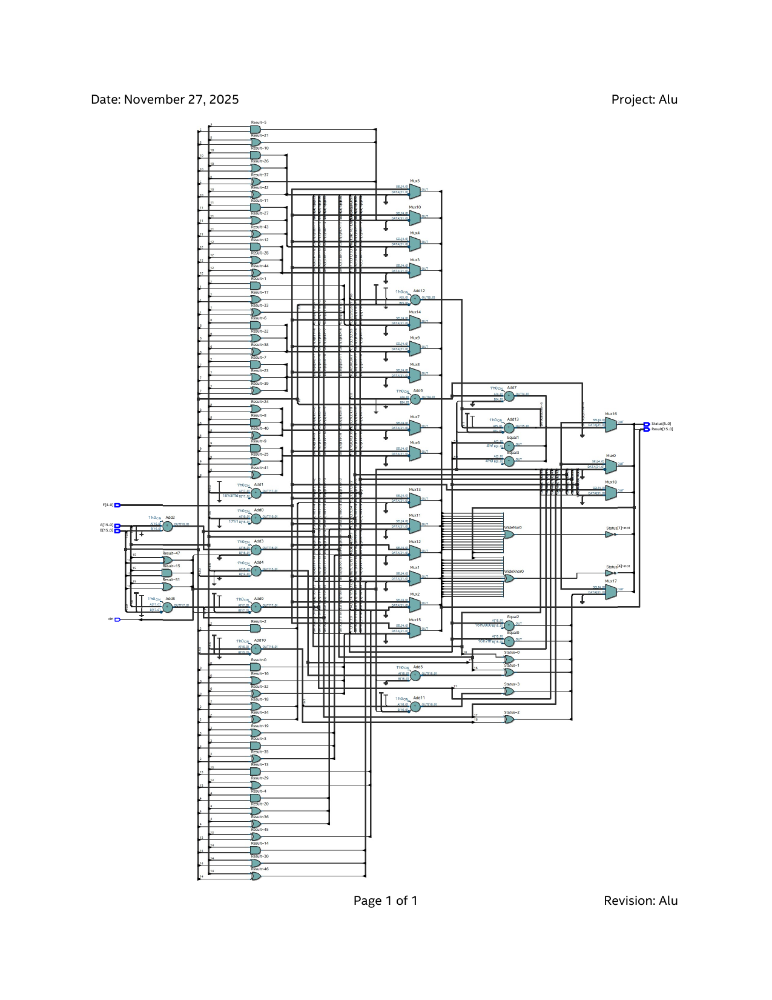
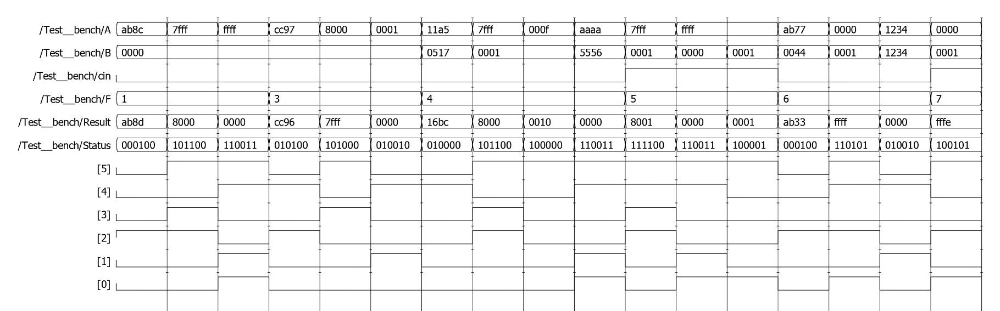
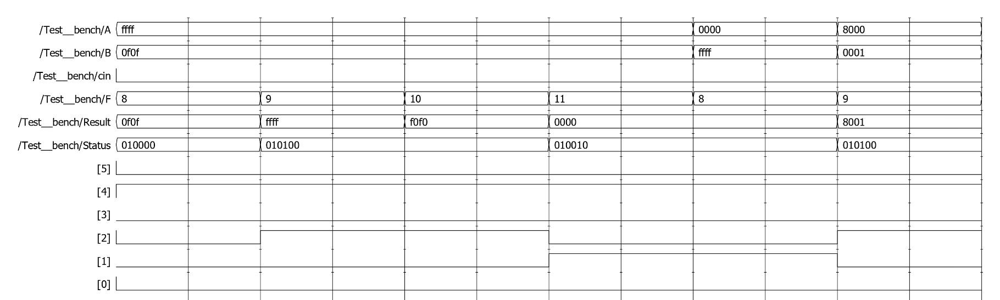
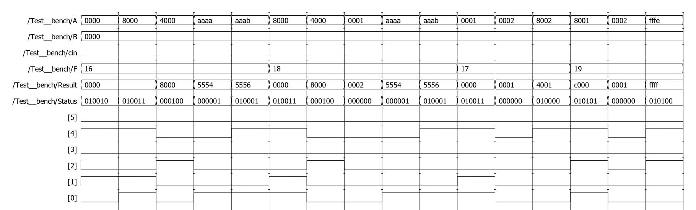
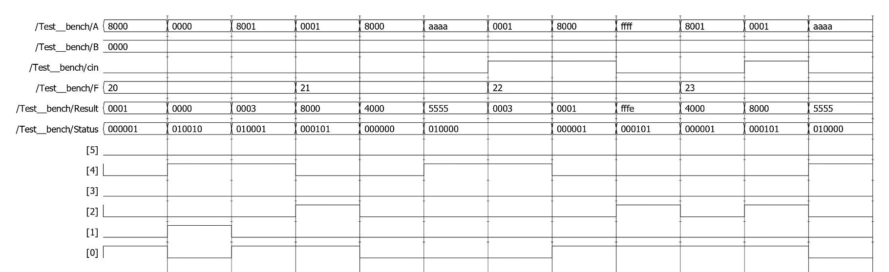

# 16-bit Arithmetic Logic Unit (ALU) — Verilog

A fully combinational **16-bit ALU** implemented in Verilog HDL, supporting 20
arithmetic, logic, shift and rotate operations with a complete 6-bit status
flag register. Built as a Microprocessor course project.


---

## Table of Contents

- [Overview](#overview)
- [Block Diagram / Ports](#block-diagram--ports)
- [Supported Functions](#supported-functions)
- [Status Flags](#status-flags)
- [Repository Structure](#repository-structure)
- [RTL Schematic](#rtl-schematic)
- [Simulation & Verification](#simulation--verification)
- [Waveforms](#waveforms)
- [How to Run](#how-to-run)


---

## Overview

This project implements a purely **combinational** 16-bit ALU (`Alu` module)
that performs 20 different operations selected through a 5-bit function code,
`F[4:0]`. The design covers:

- Two's-complement arithmetic (increment, decrement, add, add-with-carry,
  subtract, subtract-with-borrow)
- Bitwise logic operations (AND, OR, XOR, NOT)
- Logical/arithmetic shifts (SHL, SHR, SAL, SAR)
- Rotates, with and without carry-in (ROL, ROR, RCL, RCR)
- A 6-bit status register reporting **Carry, Zero, Negative, Overflow,
  Parity,** and **Auxiliary Carry** flags for every relevant operation

The design was captured in Verilog, simulated on **EDA Playground**, and
verified against a directed testbench that targets both typical and
worst-case (corner-case) inputs for every operation and every flag.

## Block Diagram / Ports

| Port     | Direction | Width | Description                                             |
|----------|-----------|:-----:|-----------------------------------------------------------|
| `A`      | Input     | 16    | First operand                                             |
| `B`      | Input     | 16    | Second operand                                             |
| `F`      | Input     | 5     | Function select code, `F[4:0]`                            |
| `cin`    | Input     | 1     | Carry-in (used by ADC/SBB and the carry-aware rotates)     |
| `Result` | Output    | 16    | Result of the selected operation                          |
| `Status` | Output    | 6     | Status flags `{A, P, V, N, Z, C}` (see below)              |

## Supported Functions

| `F[4:0]` | Code    | Operation      | Required Flags            |
|:--------:|:-------:|----------------|----------------------------|
| `00001`  | 1       | `INC`          | C, Z, N, V, P, A            |
| `00011`  | 3       | `DEC`          | C, Z, N, V, P, A            |
| `00100`  | 4       | `ADD`          | C, Z, N, V, P, A            |
| `00101`  | 5       | `ADD_CARRY`    | C, Z, N, V, P, A            |
| `00110`  | 6       | `SUB`          | C, Z, N, V, P, A            |
| `00111`  | 7       | `SUB_BORROW`   | C, Z, N, V, P, A            |
| `01000`  | 8       | `AND`          | Z, N, P                     |
| `01001`  | 9       | `OR`           | Z, N, P                     |
| `01010`  | 10      | `XOR`          | Z, N, P                     |
| `01011`  | 11      | `NOT`          | Z, N, P                     |
| `10000`  | 16      | `SHL`          | C (bit shifted out), Z, N, P|
| `10001`  | 17      | `SHR`          | C (bit shifted out), Z, N, P|
| `10010`  | 18      | `SAL`          | C (bit shifted out), Z, N, P|
| `10011`  | 19      | `SAR`          | C (bit shifted out), Z, N, P|
| `10100`  | 20      | `ROL`          | C (bit rotated out/in), Z, N, P|
| `10101`  | 21      | `ROR`          | C (bit rotated out/in), Z, N, P|
| `10110`  | 22      | `RCL`          | C (bit rotated out/in), Z, N, P|
| `10111`  | 23      | `RCR`          | C (bit rotated out/in), Z, N, P|

Any other code on `F[4:0]` (e.g. `00000`, `00010`) falls into the `default`
case, which forces `Result` and `Status` to zero.

## Status Flags

`Status[5:0]` is defined bit-by-bit as follows:

| Bit | Flag | Name           | Set When...                                                                 |
|:---:|:----:|----------------|-------------------------------------------------------------------------------|
| 0   | C    | Carry / Borrow | An arithmetic op carries out of / borrows into the MSB, or a bit is shifted/rotated out |
| 1   | Z    | Zero           | The 16-bit `Result` is exactly `16'h0000`                                    |
| 2   | N    | Negative       | `Result[15]` is `1` (two's-complement sign bit)                              |
| 3   | V    | Overflow       | A signed arithmetic result is too large/small to fit in 16 bits              |
| 4   | P    | Parity         | `Result` has an **even** number of `1` bits (even parity)                    |
| 5   | A    | Auxiliary Carry| An arithmetic op carries from bit 3 into bit 4 (low nibble → high nibble)     |

The overflow flag is computed by comparing the carry into the sign bit
(`Co14`, from adding/subtracting bits `[14:0]`) against the carry out of the
sign bit (`Status[0]`), i.e. `V = Co14 ^ Cout`. The auxiliary-carry flag is
computed the same way on the low nibble (`A[3:0]` / `B[3:0]`).

## Repository Structure

```
alu-16bit-verilog/
├── rtl/
│   └── alu.v                 # ALU design (DUT)
├── tb/
│   └── alu_tb.v               # Directed testbench (Test__bench)
├── docs/
│   ├── schematic/
│   │   └── alu_rtl_schematic.png   # Synthesized RTL schematic
│   └── waveforms/
│       ├── 01_arithmetic_operations.png
│       ├── 02_logic_operations.png
│       ├── 03_shift_operations.png
│       └── 04_rotate_operations.png
└── README.md
```

## RTL Schematic

The RTL view below shows the synthesized structure of the ALU: the bank of
adders/subtractors for each arithmetic mode, the multiplexer tree selecting
the active operation from `F[4:0]`, and the flag-generation logic feeding
`Status[5:0]`.



## Simulation & Verification

The testbench (`tb/alu_tb.v`) instantiates the ALU as `dut` and drives `A`,
`B`, `cin`, and `F` through a directed sequence covering:

- **Every one of the 20 operations** at least once
- **Worst-case / corner-case stimuli** per operation, e.g.:
  - `INC`/`DEC` at the signed boundaries (`0x7FFF`, `0x8000`) to trigger overflow
  - `ADD`/`ADC`/`SUB`/`SBB` cases that trigger carry, overflow, and auxiliary-carry simultaneously
  - Logic ops driven to all-zero and MSB-set operands to exercise Zero/Negative flags
  - Shift/rotate ops on `0x0000`, `0x8000`, alternating-bit patterns (`0xAAAA`/`0xAAAB`) to hit carry-out, zero, negative and both parity cases

Each stimulus is held for 10 time units before advancing, and a VCD dump is
enabled (`$dumpfile` / `$dumpvars`) so results can be inspected as waveforms.

## Waveforms

### Arithmetic Operations (INC, DEC, ADD, ADC, SUB, SBB)


### Logic Operations (AND, OR, XOR, NOT)


### Shift Operations (SHL, SAL, SHR, SAR)


### Rotate Operations (ROL, ROR, RCL, RCR)


> `Status` bit mapping used in the waveform viewer: `[5]=A`, `[4]=P`, `[3]=V`,
> `[2]=N`, `[1]=Z`, `[0]=C`.

## How to Run

Any Verilog-2001 compatible simulator works. Two common options:

### Option A — Icarus Verilog (local / CI)
```bash
iverilog -o alu_sim rtl/alu.v tb/alu_tb.v
vvp alu_sim
gtkwave alu_tb.vcd     # optional, to view the waveform
```

### Option B — EDA Playground (no install required)
1. Go to <https://www.edaplayground.com/>.
2. Paste `rtl/alu.v` into the **Design** pane and `tb/alu_tb.v` into the
   **Testbench** pane.
3. Select an Icarus Verilog / ModelSim simulator, enable **"Open EPWave after
   run"** (VCD dump), and click **Run**.
4. Inspect the flags and results in the waveform viewer.


Microprocessor Project — 16-bit ALU
